# Azure Deployment Evidence

These screenshots document the Azure deployment before the resource group was removed to avoid ongoing cloud costs.

## Resource Group

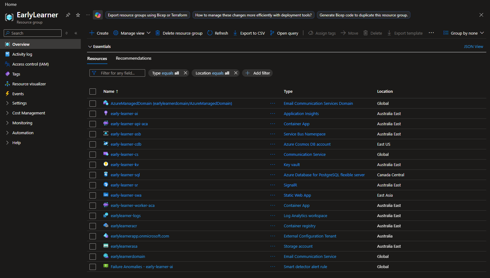

## Compute

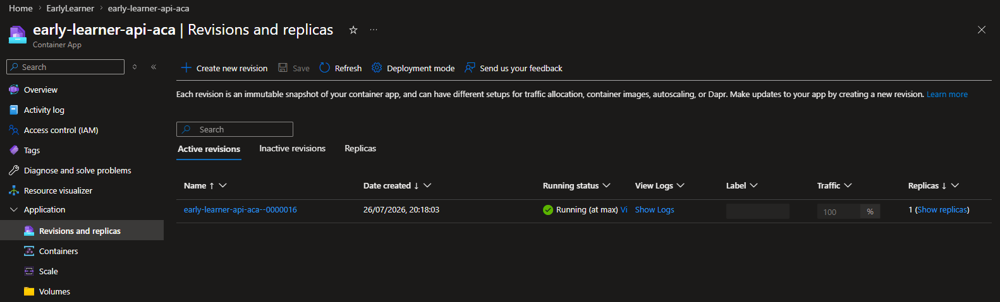

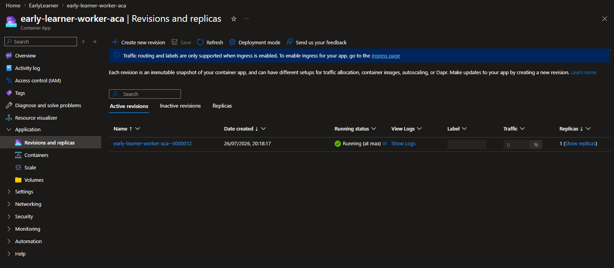

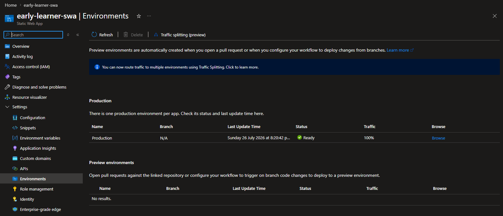

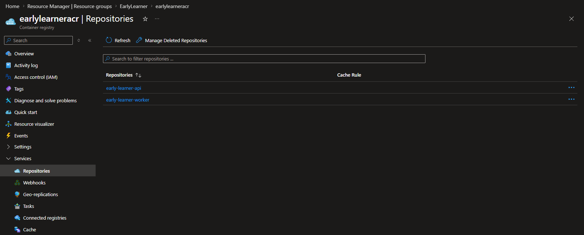

## Messaging

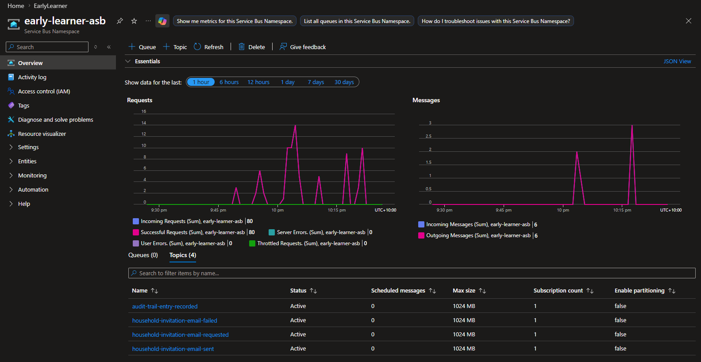

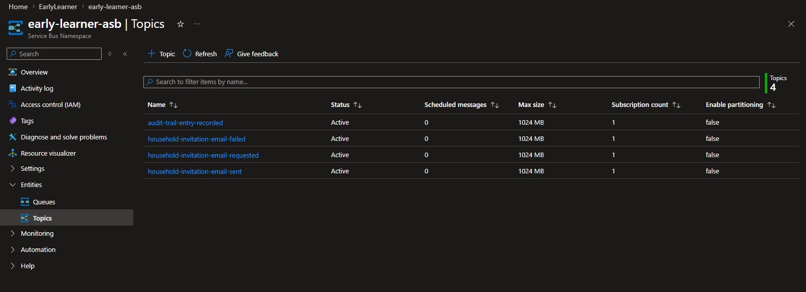

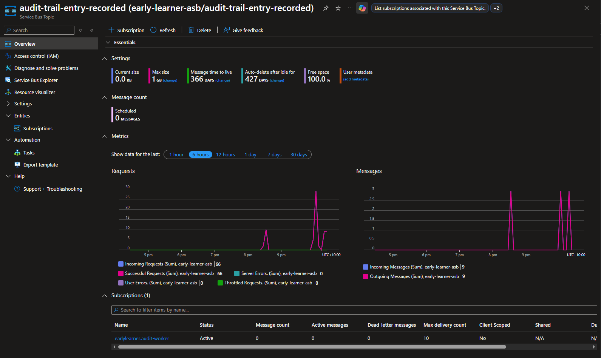

## Data and Storage

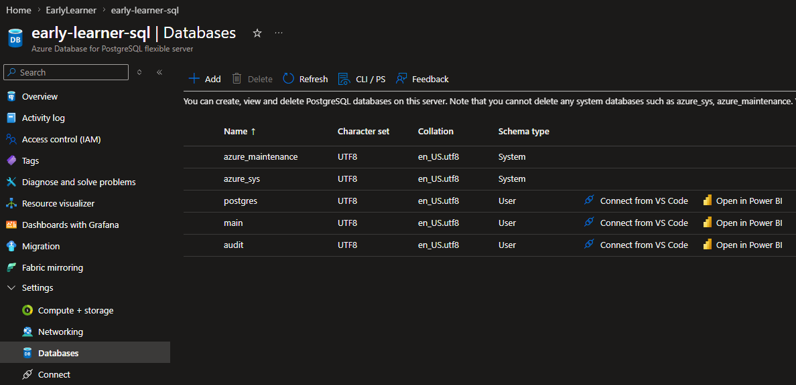

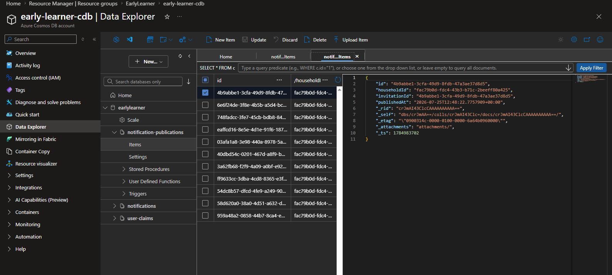

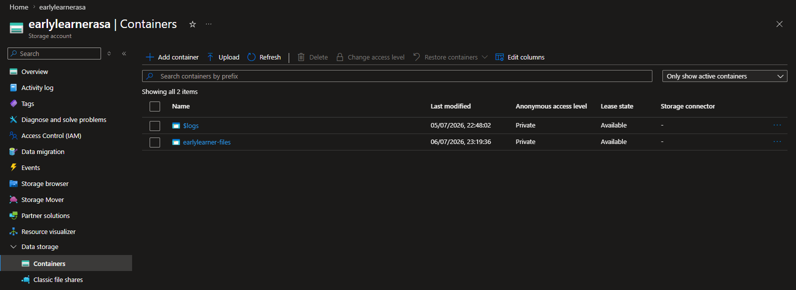

## Security

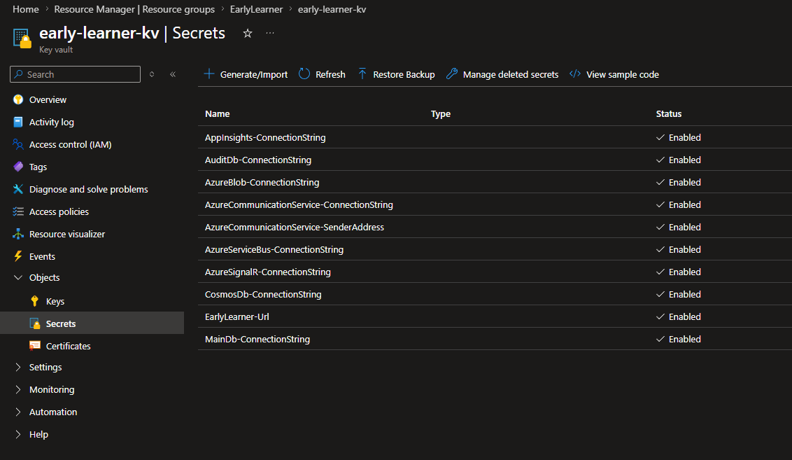

## Observability

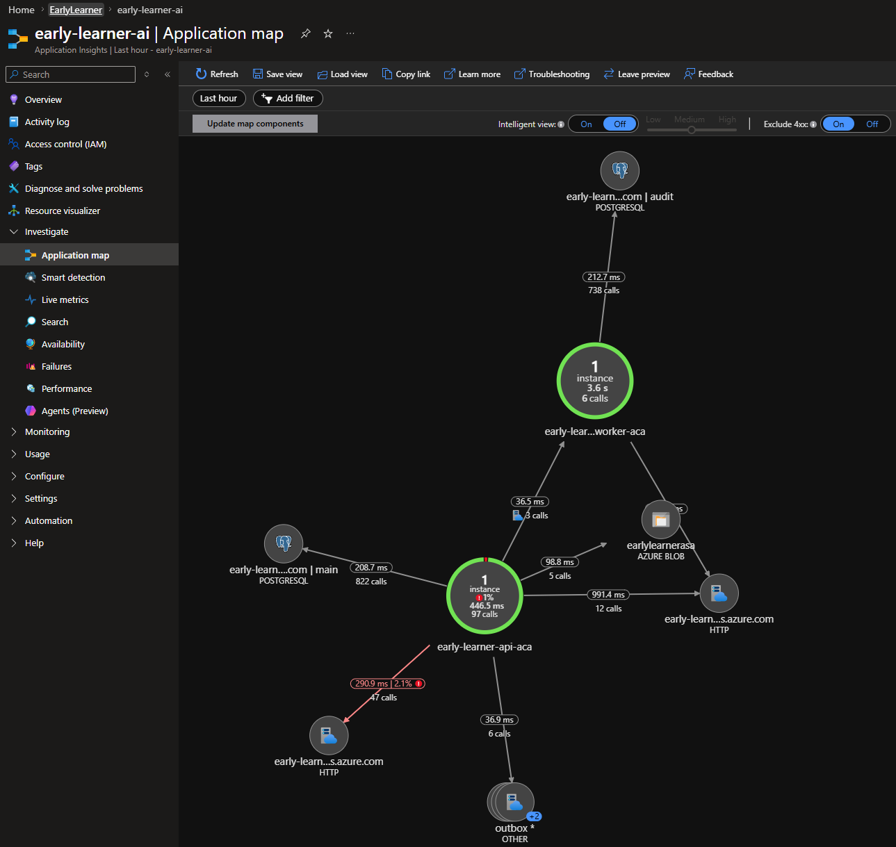

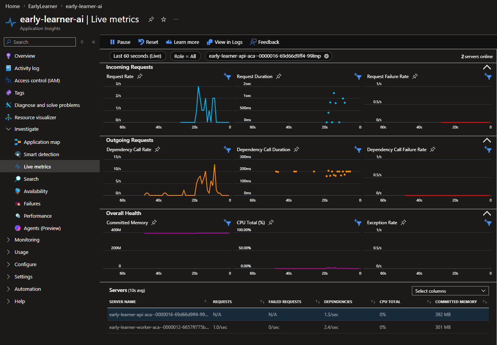

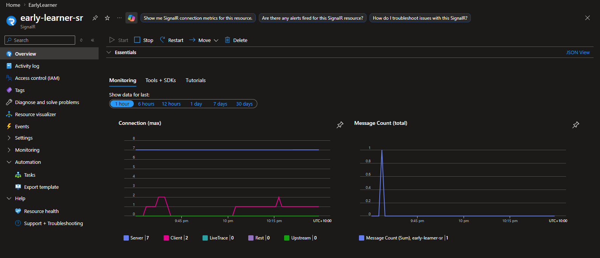
